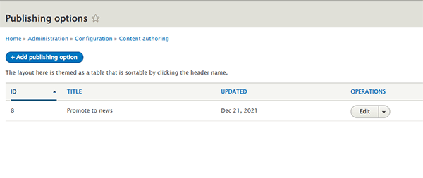
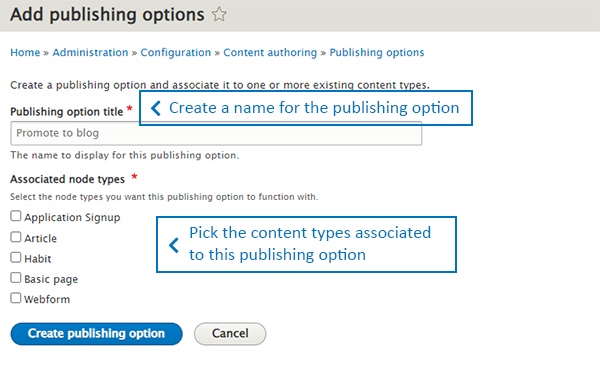
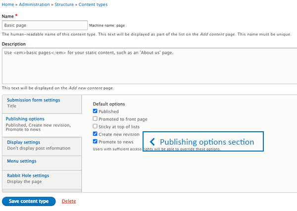
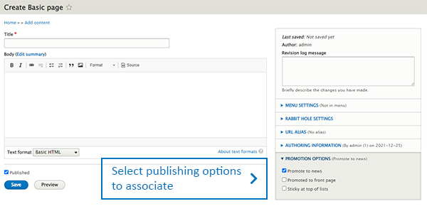
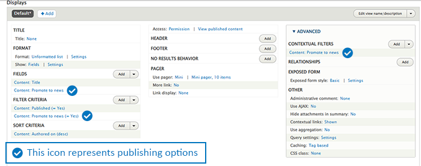

# Publishing options module

## CONTENTS OF THIS FILE
 * Introduction
 * Requirements
 * Installation
 * Configuration and usage
 * Maintainers

## INTRODUCTION
The publishing options module allows you to create your own custom promotion options.

## REQUIREMENTS
This module requires no modules outside of Drupal core.

## INSTALLATION
Install the Publishing options module as you would normally install a contributed Drupal
module. Visit https://www.drupal.org/node/1897420 for further information.

## CONFIGURATION AND USAGE
To administer publishing options, go to _Configuration > Content authoring > Publishing options_
(`/admin/config/content/publishing-options`). Here you can create, update, or remove publishing options. Click on the
`Add publishing option` button. The link will take you to the add/edit publishing options form.
\
\

To add/edit a publishing option. Type the name of the publishing option and associate the content types for this
publishing option with. Then save the publishing option.
\
\

> **_NOTE:_** You can also associate publishing options to a content type within the content type's add/edit
> page in the `Publishing options` section.
> \
> \
> **_Example link:_** Basic page, `admin/structure/types/manage/page`
> \
> \
> 

### Nodes
To associate a node to a publishing option, add/edit a node (`node/add` or `/node/%/edit`). Go to the `Promotion options`
section and select the publishing options to associate to the node.
\
\

### Views
To use publishing options with views. Create a view with _view settings show_ option set to **content**.
You can then add a publishing options fields, filters and contextual filters to the view.
\
\

---

###### Author/Maintainers
 - Jorge Calderon - https://www.drupal.org/u/geocalleo
